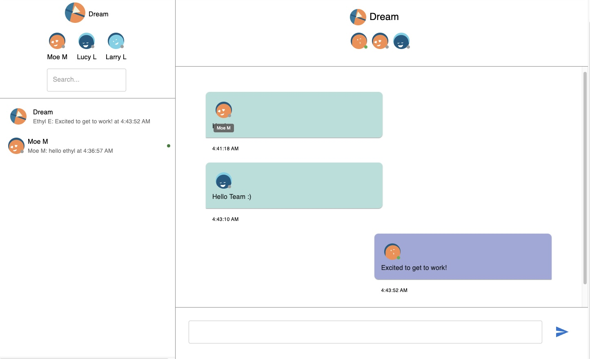
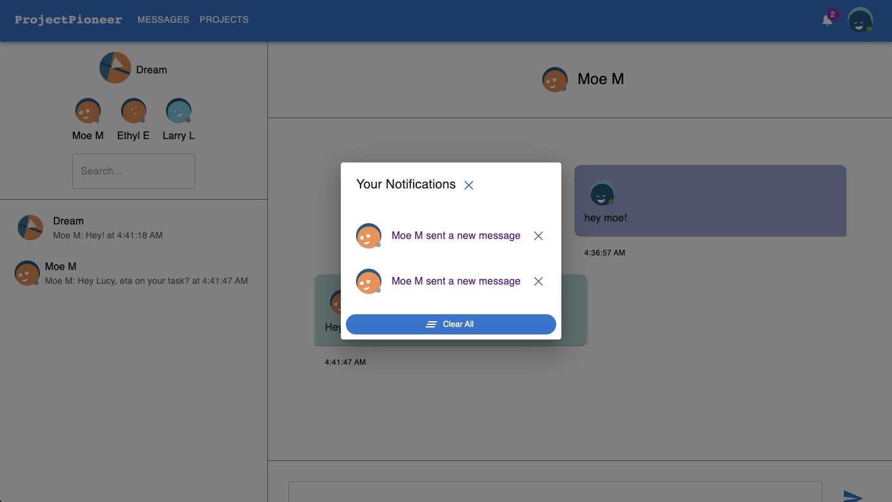
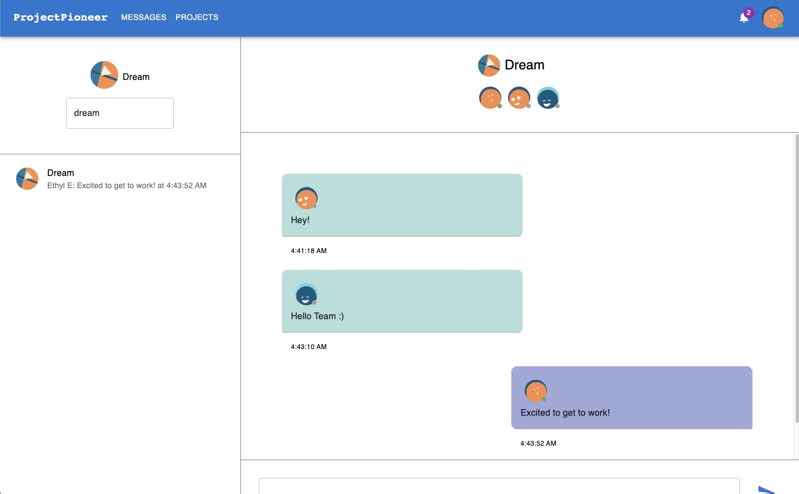
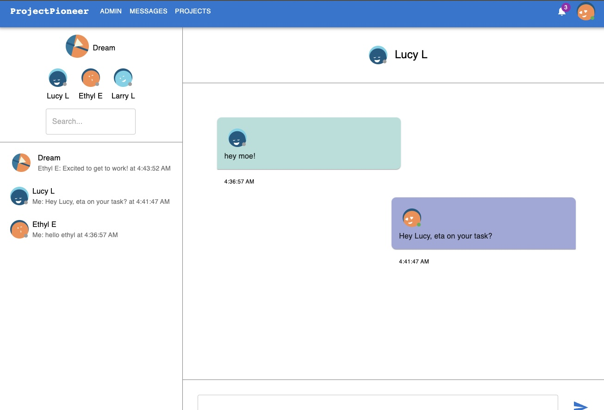

<h1 align="center">Capstone - Project Management App 📊</h1>

## 👨‍💻 About The Project

Our Capstone Project aimed to design and implement a project management tool to enhance team collaboration, task organization, and project tracking. As an integral part of the team, my main contribution was the creation of a real-time messaging system and live notifications. This system greatly boosted communication within teams and assured immediate updates.

## 🛠️ Built With

This application was built utilizing a collection of technologies including but not limited to:

* JavaScript
* React
* Redux
* Node.js
* Express
* PostgreSQL

## 📖 Features

* Real-time messaging system: Facilitates immediate communication among team members.
* Live notifications: Ensures everyone is up-to-date with the latest project developments.
* Task organization: Offers tools for categorizing and prioritizing tasks.
* Project tracking: Allows team members and managers to monitor the progress of different projects.

## 📸 Snapshot of the Project

---

---

---

